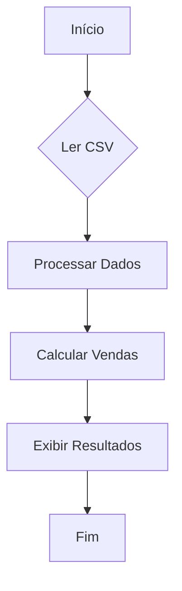

# Aula 07: Funções em Python e Estrutura de Dados - Parte 1

O repositório oficial desta aula pode ser acessado [aqui](https://github.com/lvgalvao/data-engineering-roadmap/tree/main/Bootcamp%20-%20Python%20para%20dados/aula07).

## Conteúdo

Nesta aula, exploramos as **funções em Python** e **estruturas de dados** como listas e dicionários. Esses conceitos são fundamentais para o desenvolvimento de código modular, legível e eficiente, especialmente na manipulação de dados e criação de sistemas complexos.

### Motivação

A principal motivação para utilizar funções em Python é a **reutilização de código**. Elas permitem que um mesmo bloco de código seja executado várias vezes com diferentes argumentos, produzindo resultados variados. Isso contribui para um código mais **limpo**, **modular**, e **fácil de depurar**.

### Definindo Funções

Funções em Python são definidas com a keyword `def`, seguida do nome da função, parênteses `()` e dois pontos `:`. O corpo da função deve ser indentado corretamente.

### Nomes de Funções

Os nomes das funções seguem as mesmas regras que variáveis: podem conter letras, números (não no início) e underscores (`_`), mas não podem conter espaços ou caracteres especiais. Além disso, devem ser **descritivos** e, por convenção, seguir o formato `snake_case`.

### Parâmetros e Argumentos

- **Parâmetros**: Variáveis que aparecem nos parênteses da definição da função. São placeholders para os valores que a função irá manipular.
- **Argumentos**: Os valores reais que você passa para a função quando a chama.

### Palavras-chave importantes

- **`def`**: Inicia a definição de uma função.
- **`return`**: Define o valor que a função retorna. Se omitido, a função retorna `None`.
- **`pass`**: Usado como placeholder para funções vazias.

### Chamando Funções

Funções são chamadas usando o nome seguido de parênteses, com os argumentos necessários dentro.

### Valores Padrão e Argumentos Nomeados

Funções podem ter parâmetros com valores padrão, tornando opcional a passagem de todos os argumentos ao chamar a função. Além disso, argumentos podem ser nomeados para maior clareza ao chamar a função.

## Exercícios

Nesta aula, foram propostos exercícios práticos que envolvem a criação de funções e a utilização de **type hints** e **Pydantic** para garantir a clareza e robustez do código.

## Desafio: Análise de Vendas de Produtos

Objetivo: Processar um arquivo CSV de vendas de produtos, calcular e reportar as vendas totais por categoria.

### Fluxo:



### Tarefas:

1. **Ler o arquivo CSV** e carregar os dados em uma lista de dicionários.
2. **Processar os dados**, organizando-os por categoria de produto.
3. **Calcular o total de vendas** por categoria, multiplicando a quantidade pelo valor de venda.

### Funções:

1. **`ler_csv`**: Função que lê o arquivo CSV e retorna uma lista de dicionários.
2. **`processar_dados`**: Função que organiza os dados em um dicionário por categoria.
3. **`calcular_vendas_categoria`**: Função que calcula o total de vendas por categoria.

## Como Executar

Para executar os scripts Python com as soluções dos exercícios e o desafio, siga os passos abaixo:

1. Certifique-se de que o [Python](https://www.python.org/) esteja instalado em seu sistema.
2. Clone este repositório em seu computador:
   ```sh
   git clone git@github.com:seurepositorio/bootcamp-python.git
   ```
3. Navegue até o diretório onde você clonou o repositório:
   ```sh
   cd caminho/para/o/diretorio/bootcamp-python/aula07
   ```
4. Execute os scripts Python desejados com os seguintes comandos:
   ```sh
   python main.py
   ```
   ```sh
   python desafio.py
   ```

A execução desses scripts permitirá revisar os conceitos abordados, verificar os resultados dos exercícios e explorar os exemplos práticos apresentados na aula.
