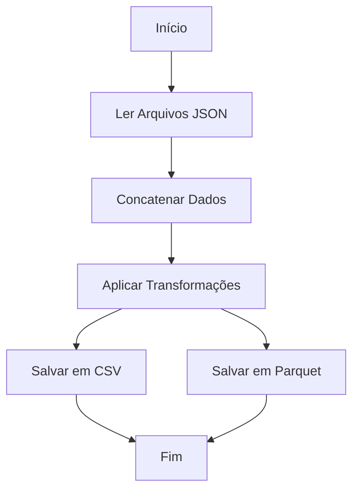

# Aula 08: Funções em Python - ETL com Pandas, JSON e Parquet

O repositório oficial desta aula pode ser acessado [aqui](https://github.com/lvgalvao/data-engineering-roadmap/tree/main/Bootcamp%20-%20Python%20para%20dados/aula08).

## Conteúdo

Nesta aula, exploramos como realizar um processo de **ETL (Extract, Transform, Load)** utilizando Python e a biblioteca **Pandas**. Esses conceitos são essenciais para o desenvolvimento de pipelines de dados robustos.

### ETL com Pandas

O processo de ETL é fundamental em engenharia de dados e consiste em:

- **Extract (Extração)**: Ler dados de diversas fontes, como arquivos JSON, CSV, bancos de dados, APIs, etc.
- **Transform (Transformação)**: Processar e manipular os dados para adequá-los às necessidades do negócio. Isso pode incluir limpeza, agregação, enriquecimento, etc.
- **Load (Carga)**: Carregar os dados transformados em um destino, como um data warehouse, banco de dados ou arquivos em formatos específicos (CSV, Parquet, etc.).

Nesta aula, realizamos um ETL simples:

1. **Extract**: Leitura de dados de um arquivo JSON utilizando Pandas.
2. **Transform**: Concatenar os dados extraídos em um único `DataFrame` e aplicar transformações específicas.
3. **Load**: Salvar o `DataFrame` resultante em um arquivo CSV ou Parquet.

### Motivação

A realização de processos ETL é uma atividade central na preparação e integração de dados para análises avançadas. Utilizar ferramentas como **Pandas** facilita a manipulação e transformação dos dados de forma eficiente.

### Conclusão

O uso de **Pandas** para processos ETL simplifica a manipulação de dados, permitindo operações eficientes e poderosas.

## Desafio: Implementando uma ETL

### Objetivo

Criar um pipeline ETL que:

1. **Extract**: Leia dados de múltiplos arquivos JSON.
2. **Transform**: Concatene os dados em um único `DataFrame`, aplique transformações necessárias.
3. **Load**: Salve o `DataFrame` resultante em um arquivo Parquet ou CSV.

### Fluxo



## Como Executar

Para executar o script Python com a solução do desafio, siga os passos abaixo:

1. Certifique-se de que o [Python](https://www.python.org/) e o [Poetry](https://python-poetry.org/docs/#installation) estejam instalados em seu sistema.
2. Clone este repositório em seu computador:

   ```sh
   git clone git@github.com:seurepositorio/bootcamp-python.git
   ```

3. Navegue até o diretório da aula:

   ```sh
   cd caminho/para/o/diretorio/bootcamp-python/aula08
   ```

4. Instale as dependências do projeto usando o Poetry:

   ```sh
   poetry install
   ```

5. Execute o script Python:

   ```sh
   poetry run python main.py
   ```