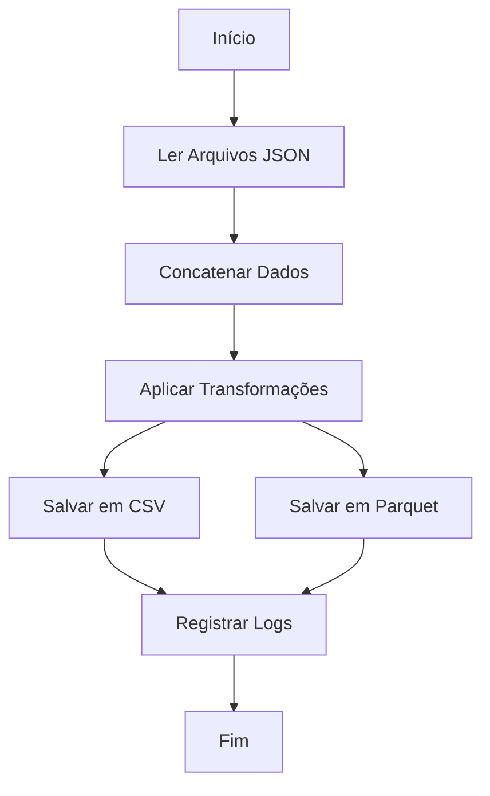

# Aula 09: Funções em Python - Decoradores

O repositório oficial desta aula pode ser acessado [aqui](https://github.com/lvgalvao/data-engineering-roadmap/tree/main/Bootcamp%20-%20Python%20para%20dados/aula09).

## Conteúdo

Nesta aula, exploramos como utilizar **decoradores** em Python para adicionar funcionalidades a funções de maneira prática e eficiente. Abordamos também o uso de **logging** com a biblioteca **Loguru**, que simplifica a forma como fazemos logs em nossas aplicações. Esses conceitos são essenciais para melhorar a reusabilidade, eficiência e monitoramento de código, especialmente em aplicações de engenharia de dados.

### Usando LOG

O **logging** é uma ferramenta poderosa para monitorar e depurar aplicações. Tradicionalmente, podemos usar `print` ou um depurador, mas o **Loguru** oferece uma abordagem mais robusta e flexível para registrar informações sobre a execução do software, especialmente em ambientes de produção.

### Loguru

O **Loguru** é uma biblioteca de logging para Python que oferece uma API simples e poderosa, sem necessidade de configurações complexas. Com ele, podemos registrar mensagens em arquivos, rotação automática de arquivos, e até enviar logs para múltiplos destinos. Isso facilita o monitoramento e a depuração de erros, proporcionando uma visão clara do comportamento do sistema.

Nesta aula, aprendemos a:

1. **Configurar o Loguru** para registrar logs no console e em arquivos.
2. **Implementar logs em funções** usando decoradores.
3. **Capturar exceções** e registrá-las automaticamente com informações detalhadas de erro.

### Decoradores

Um decorador é uma função que permite modificar o comportamento de outras funções de maneira clara e reutilizável. Decoradores são amplamente utilizados para adicionar funcionalidades a funções sem alterar seu código original. Nesta aula, utilizamos decoradores para adicionar:

- **Logs automáticos**: Registrar automaticamente a entrada, saída e exceções das funções.
- **Medição de tempo**: Calcular o tempo de execução das funções decoradas.

### Motivação

O uso de **decoradores** combinado com o **Loguru** facilita a adição de funcionalidades como logs e medição de desempenho sem alterar diretamente o código das funções. Isso promove a **reutilização** de código e melhora a **manutenibilidade** das aplicações, especialmente em pipelines de dados que envolvem processos complexos, como ETL.

### Conclusão

A utilização de **decoradores** com **Loguru** torna o código mais eficiente e modular. Eles são especialmente úteis para monitorar aplicações, capturar erros e medir o desempenho, sem a necessidade de modificar cada função individualmente. Essa abordagem centraliza as preocupações de logging e monitoramento, tornando o código mais limpo e fácil de manter.

## Desafio:

### Objetivo

Refatore o desafio da `aula08` implementando o uso de decoradores.

### Fluxo



## Como Executar

Para executar o script Python com a solução do desafio, siga os passos abaixo:

1. Certifique-se de que o [Python](https://www.python.org/) e o [Poetry](https://python-poetry.org/docs/#installation) estejam instalados em seu sistema.
2. Clone este repositório em seu computador:

   ```sh
   git clone git@github.com:seurepositorio/bootcamp-python.git
   ```

3. Navegue até o diretório da aula:

   ```sh
   cd caminho/para/o/diretorio/bootcamp-python/aula08
   ```

4. Instale as dependências do projeto usando o Poetry:

   ```sh
   poetry install
   ```

5. Execute o script Python:

   ```sh
   poetry run python main.py
   ```

A execução do script iniciará o processo ETL com logging detalhado de cada etapa. Verifique o arquivo de log gerado para acompanhar o fluxo de execução e possíveis mensagens de erro.

